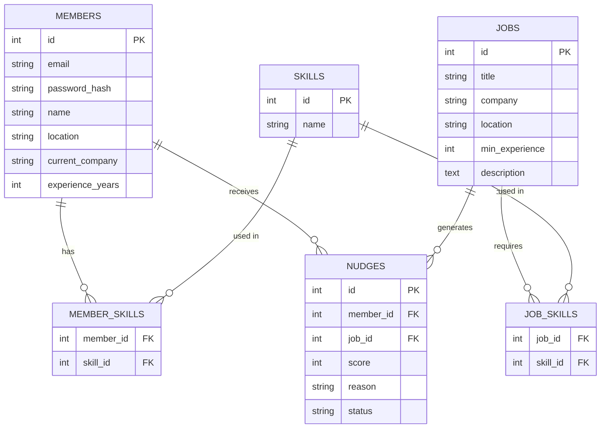
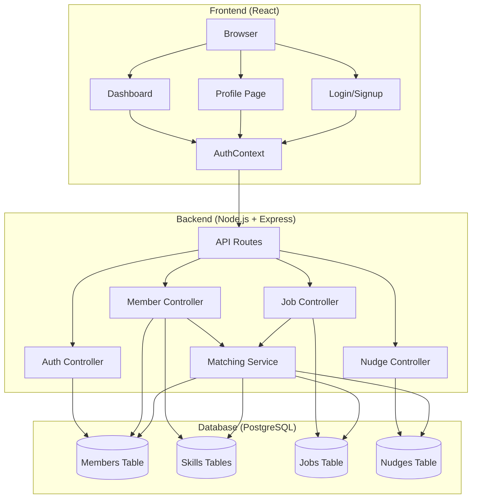
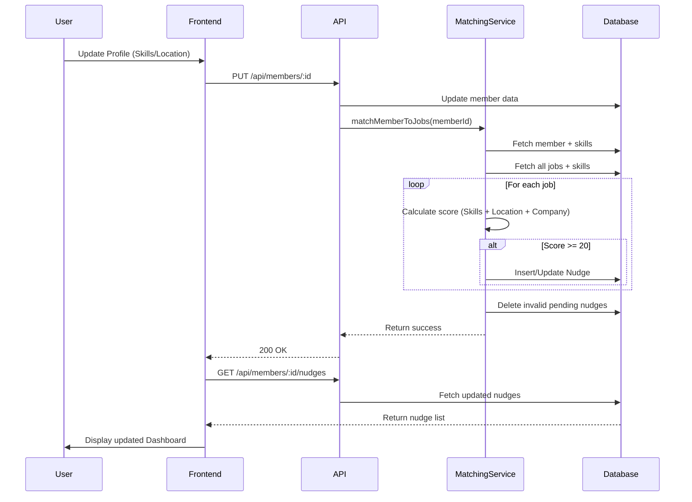

# Pieworks Project Documentation

**Project Name**: Pieworks Referral Engine
**Version**: 1.0.0
**Date**: February 9, 2026

---

## 1. Project Overview
Pieworks is a full-stack web application designed to intelligently match employees ("Members") with open job opportunities ("Jobs") at their company or partner companies. It facilitates the referral process by generating "Nudges" — smart recommendations based on skill overlaps, location, and alumni status.

### Demo Video
https://github.com/user-attachments/assets/2d344140-833c-4e71-8942-7c5c7edaa4e8
<video width="640" height="360" controls>
  <source src="https://github.com/user-attachments/assets/2d344140-833c-4e71-8942-7c5c7edaa4e8" type="video/mp4">
</video>


## 2. System Architecture & Design

### 2.1 Backend Design (Node.js + Express)
The backend follows a **Layered Architecture** to ensure separation of concerns:
-   **Routes Layer**: Defines API endpoints (e.g., `POST /api/auth/login`).
-   **Controller Layer**: Handles HTTP requests, input validation, and sends responses.
-   **Service Layer**: Contains core business logic (e.g., `MatchingService`).
-   **Data Access Layer**: Direct interactions with PostgreSQL using `pg` pool.

### 2.2 Database Design (PostgreSQL)
The database uses a normalized schema with Many-to-Many relationships for skills:
-   **Members**: Users of the platform (`id`, `email`, `password_hash`, `location`).
-   **Jobs**: Open positions (`id`, `title`, `company`, `location`).
-   **Skills**: A central catalog of skills (`id`, `name`).
-   **Member_Skills / Job_Skills**: Junction tables linking Members and Jobs to Skills.
-   **Nudges**: Recommendations linking a Member to a Job (`member_id`, `job_id`, `score`, `status`).

### 2.3 Frontend Design (React + Tailwind)
-   **Component-Based**: Reusable UI components like `NudgeCard`.
-   **Responsive Layout**: Uses CSS Grid (`grid-cols-1 md:grid-cols-3`) to adapt from mobile to desktop.
-   **Utilities**: TailwindCSS is used for rapid, consistent styling without writing custom CSS files.
-   **State Management**: `AuthContext` provides global access to the logged-in user state.

### 2.4 Database Schema (ERD)


### 2.5 System Architecture Diagram


---

## 3. Core Logic & Algorithms

### 3.1 The Matching Engine (`matchingService.js`)
The core value proposition is the "Nudge" generation. This logic runs efficiently in the backend.

**Scoring Algorithm**:
Each Member-Job pair is assigned a score (0-100) based on weighted criteria:
1.  **Skills Match (50%)**:
    -   *Logic*: `(Matching Skills / Total Job Skills) * 50`
    -   *Example*: If a job needs [React, Node] and user has [React], score = (1/2)*50 = 25 points.
2.  **Location Match (20%)**:
    -   *Logic*: Exact string match (case-insensitive) between Member City and Job City.
    -   *Why*: Proximity increases the likelihood of a successful hire.
3.  **Company/Alumni Match (30%)**:
    -   *Logic*: Match between Member's `current_company` and Job's `company`.
    -   *Why*: Referrals are most effective when verifying someone you've worked with.

**Threshold**: Only pairs with a **Score >= 20** are saved as "Nudges".

### 3.2 Matching Workflow Diagram


### 3.3 Real-time Recalculation & Cleanup
To ensure the dashboard is always accurate, the matching logic is event-driven:
-   **Trigger**: Whenever a User updates their Profile (PUT `/api/members/:id`).
-   **Step 1 (Cleanup)**: The system executing a *Cleanup Routine* to delete 'pending' Nudges that no longer meet the matching criteria (e.g., user moved cities).
-   **Step 2 (Recalculate)**: The system re-runs the scoring algorithm against *all* active jobs.
-   **Step 3 (Update)**: New valid Nudges are inserted/updated in the database.

### 3.3 Security Logic
-   **Stateless Authentication**: Uses JSON Web Tokens (JWT). The server does not store session state.
-   **Password Hashing**: Uses `bcryptjs` with Salt Rounds = 10. Passwords are never stored in plain text.
-   **Protected Routes**: Middleware verifies the `Authorization: Bearer <token>` header before allowing access to private data.

---

## 4. Setup Instructions

### Prerequisites
-   Docker Desktop installed and running.

### Running the Application
1.  **Start Services**:
    ```bash
    docker-compose up --build
    ```
    -   Backend runs on `http://localhost:5000`
    -   Frontend runs on `http://localhost:5173`
    -   Database runs on `localhost:5432`

2.  **Access App**: Open your browser to `http://localhost:5173`.
3.  **Login Credentials** (Pre-seeded):
    -   User: `alice@example.com` / `password123`
    -   User: `bob@example.com` / `password123`

## 5. Directory Structure
```
pie-works/
├── backend/
│   ├── src/controllers/    # API Handlers
│   ├── src/services/       # Matching Logic
│   └── database/           # SQL Schema
├── frontend/
│   ├── src/pages/          # React Views
│   └── src/context/        # Global State
└── docker-compose.yml      # Deployment Config
```
